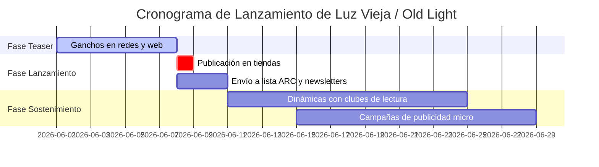

# Hoja de Ruta de Lanzamiento y Publicación — Luz Vieja / Old Light

Este documento consolida la checklist oficial de publicación y marketing para las ediciones en español e inglés de la obra de ciencia ficción **Luz Vieja / Old Light**, asignando cada tarea al rol competente de la editorial para garantizar la calidad y el cumplimiento normativo.

---

## 📋 Checklist Oficial y Asignación de Roles

A continuación se detalla la distribución de tareas entre los diferentes roles/departamentos de **EditorIAl IOREB**:

### 1. Control de Calidad del Texto y Localización
* **[ ] Revisar ortografía en castellano**
  * **Asignado a:** Corrector Ortotipográfico (`rol_editorial_corrector`).
  * **Acciones:** Validar concordancia de rayas de diálogo, comillas latinas/inglesas y depurar erratas tipográficas en [manuscrito/](file:///c:/ReposGit/LuzVieja/manuscrito/).
* **[ ] Revisar inglés por corrector nativo o humano competente**
  * **Asignado a:** Traductor y Localizador (`rol_editorial_traductor`) / Editor de Mesa (`rol_editorial_editor`).
  * **Acciones:** Efectuar una lectura comparativa final sobre [traducciones/en/manuscrito/](file:///c:/ReposGit/LuzVieja/traducciones/en/manuscrito/) para pulir la fluidez idiomática y giros naturales.

### 2. Validación Técnica y Maquetación
* **[ ] Validar EPUB en Kindle Previewer**
  * **Asignado a:** Productor Editorial (`rol_editorial_productor`).
  * **Acciones:** Cargar [LuzVieja.epub](file:///c:/ReposGit/LuzVieja/exportacion/es/LuzVieja.epub) y [OldLight.epub](file:///c:/ReposGit/LuzVieja/exportacion/en/OldLight.epub) en el software oficial Kindle Previewer para auditar la maquetación en diferentes tamaños y orientaciones de pantalla.
* **[ ] Validar portada en la vista previa de Amazon KDP**
  * **Asignado a:** Productor Editorial (`rol_editorial_productor`).
  * **Acciones:** Subir y comprobar la portada genérica y la portada localizada ([portada_en.png](file:///c:/ReposGit/LuzVieja/exportacion/portada_en.png)) en el visualizador KDP, verificando sangrías, márgenes de seguridad y alineación tipográfica.
* **[ ] Comprobar que índice y capítulos funcionan**
  * **Asignado a:** Productor Editorial (`rol_editorial_productor`).
  * **Acciones:** Comprobar la navegación del menú TOC digital, los saltos de sección, y verificar que los archivos de LaTeX correspondientes compilen adecuadamente y generen un índice completo y enlazado.
* **[ ] Añadir página legal**
  * **Asignado a:** Productor Editorial (`rol_editorial_productor`).
  * **Acciones:** Automatizado e integrado directamente en los compiladores de EPUB y LaTeX para inyectarse de forma nativa en ambas lenguas.

### 3. Compliance Normativo y Distribución
* **[ ] Declarar IA si corresponde**
  * **Asignado a:** Responsable de Compliance (`rol_editorial_compliance`).
  * **Acciones:** Cumplimentar el cuestionario de carga en KDP y Google Play declarando el uso transparente de IA de acuerdo con la `regla_editorial_02_etica_ia_y_transparencia.md` e incluir la nota aclaratoria correspondiente en la página legal.
* **[ ] No activar KDP Select si se publica en Google Play**
  * **Asignado a:** Responsable de Compliance (`rol_editorial_compliance`) / CEO (`rol_editorial_ceo`).
  * **Acciones:** Validar que la casilla "Inscribir este libro en KDP Select" esté desactivada durante la carga en Amazon, permitiendo así la venta digital concurrente del EPUB en Google Play Books.
* **[ ] Publicar español e inglés como libros separados**
  * **Asignado a:** Responsable de Compliance (`rol_editorial_compliance`).
  * **Acciones:** Registrar dos productos distintos con sus respectivos ASIN/ISBN e idiomas correctos para maximizar la indexación comercial SEO específica de cada mercado.

### 4. Campaña de Marketing
* **[ ] Preparar campaña de lanzamiento mínima**
  * **Asignado a:** Editor de Mesa (`rol_editorial_editor`) / Creador de Concepto (`rol_editorial_creativo`) / CEO (`rol_editorial_ceo`).
  * **Acciones:** Ejecutar el plan promocional que se detalla en la sección correspondiente de esta hoja de ruta.

---

## ⚖️ Textos de las Páginas Legales Oficiales

### Versión en Español (Luz Vieja)
> **Luz Vieja**  
> Autor: Ioreb  
> © 2026, Ioreb. Todos los derechos reservados.  
>   
> Cualquier forma de reproducción, distribución, comunicación pública o transformación de esta obra solo puede ser realizada con la autorización de sus titulares, salvo excepción prevista por la ley. Diríjase a CEDRO (Centro Español de Derechos Reprográficos) si necesita fotocopiar o escanear algún fragmento de esta obra.  
>   
> Diseño de portada: Ioreb.  
>   
> **Declaración de Asistencia de IA:** Esta obra de ciencia ficción ha sido desarrollada y traducida con la asistencia de modelos de lenguaje de inteligencia artificial como parte de un proceso creativo agéntico iterativo en EditorIAl IOREB.

### Versión en Inglés (Old Light)
> **Old Light**  
> Author: Ioreb  
> © 2026, Ioreb. All rights reserved.  
>   
> No part of this publication may be reproduced, distributed, or transmitted in any form or by any means, including photocopying, recording, or other electronic or mechanical methods, without the prior written permission of the publisher, except in the case of brief quotations embodied in critical reviews and certain other noncommercial uses permitted by copyright law.  
>   
> Cover design by: Ioreb.  
>   
> **AI Assistance Declaration:** This work of science fiction was developed and translated with the assistance of artificial intelligence language models as part of an iterative agentic creative process at EditorIAl IOREB.

---

## 📈 Plan Mínimo de Campaña de Lanzamiento

### 1. Posicionamiento y USP (Propuesta Única de Venta)
* **One-liner (Gancho comercial):** *"A veces, el silencio del universo es la única respuesta que deberíamos temer."* (Español) / *"Sometimes, the silence of the universe is the only answer we should fear."* (Inglés)
* **Segmento Objetivo:** Lectores de ciencia ficción dura con inclinación contemplativa (lectores afines a Ted Chiang, Arthur C. Clarke, y Greg Egan).
* **Descripción Breve:** Una señal estelar que viaja a la velocidad de la luz tarda veinte años en llegar a Kael. Cuando la reciben, comprenden que están escuchando una civilización extinta. ¿Qué ocurre cuando la luz del pasado nos revela nuestro propio destino?

### 2. Estrategia de ARC Readers (Advance Reading Copy) y Reseñas
* **Captación Ética:** Compartir copias de prueba gratuitas (EPUB) a una lista seleccionada de 20 lectores beta de ciencia ficción dura mediante redes de nicho.
* **Política de Transparencia:** Los lectores de ARC deben declarar de forma explícita y transparente en su reseña que han recibido una copia gratuita a cambio de su opinión honesta, en estricto cumplimiento con la `regla_editorial_09_compliance_plataformas.md`.

### 3. Fases del Calendario Promocional

* **Fase 1: Teaser (7 días antes del lanzamiento):**
  * Publicación de ganchos científicos (los datos del receptor de Kael, la asimetría temporal) en redes y blog de la editorial.
  * Revelación de las portadas ([portada.png](file:///c:/ReposGit/LuzVieja/exportacion/es/portada.png) y [portada_en.png](file:///c:/ReposGit/LuzVieja/exportacion/portada_en.png)).
* **Fase 2: Lanzamiento (Día D a Día D+3):**
  * Publicación simultánea pero independiente de ambos libros en Amazon KDP y Google Play.
  * Envío masivo de notificaciones al boletín de suscriptores e invitación a los ARC Readers a publicar sus opiniones legítimas.
* **Fase 3: Sostenimiento (Día D+4 en adelante):**
  * Monitoreo de reseñas orgánicas.
  * Contactar con podcasts o blogs dedicados a la ciencia ficción dura para proponer lecturas conjuntas y reseñas del libro.
  * Análisis semanal de conversión de ventas para evaluar el rendimiento.
